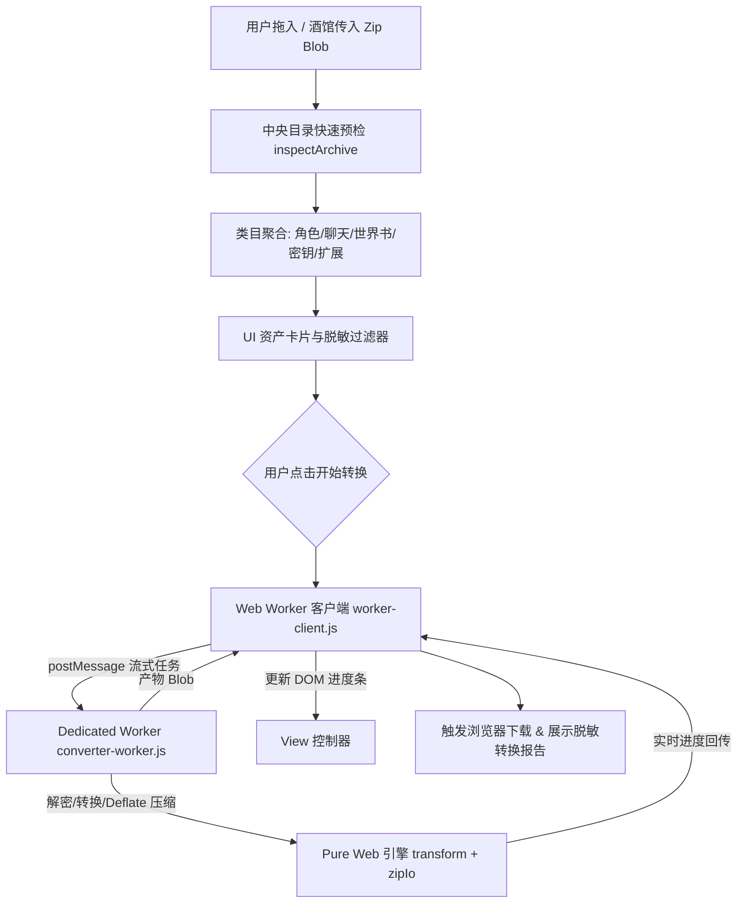

# Web Worker 多线程加速与独立模式类目选择性导出 Technical Design

## 1. 架构总览 (Architecture Overview)



---

## 2. 模块分类规则与 inspectArchive (`src/core/inspect.js`)

在中央目录预检阶段，只遍历 entry 头信息（`fileName`、`uncompressedSize`），不解压、不开流，几毫秒内完成。

### 类目归类矩阵 (Category Mapping Matrix)

| 类目 ID | 对应 hub 路径规则 | 说明 | 默认状态 |
|---------|------------------|------|----------|
| `characters` | `characters/**` | 角色卡（PNG / JSON） | 默认勾选 (true) |
| `chats` | `chats/**` | 历史聊天记录（JSONL） | 默认勾选 (true) |
| `worlds` | `worlds/**` | 世界书 / Lorebooks | 默认勾选 (true) |
| `settings` | `settings.json`, `presets/**`, `OpenAI Settings/**`, `tauritavern-settings.json` | 用户全局偏好与模型预设 | 默认勾选 (true) |
| `secrets` | `secrets.json` | 用户的 API 密钥（OpenAI/Anthropic/Claude 等） | 默认勾选 (true)，脱敏预设下一键取消 |
| `avatars` | `User Avatars/**` | 用户头像与图标 | 默认勾选 (true) |
| `extensions` | `extensions/third-party/**`, `data/extensions/third-party/**` | 第三方扩展与来源记录 | 默认勾选 (true) |
| `derived` | `thumbnails/**`, `backups/**`, `vectors/**`, `_cache/**` | 派生缓存（按原 keepAll 逻辑管控） | 默认不保留 |

---

## 3. 转换管线过滤控制 (`src/core/transform.js`)

在 `convert(source, dest, options)` 中：
```js
const DEFAULT_SELECTION = {
  characters: true,
  chats: true,
  worlds: true,
  settings: true,
  secrets: true,
  avatars: true,
  extensions: true,
};
```
在遍历条目时，`categoryOf(routed.hubPath)` 判断该条目属于哪个类目：
- 若 `selection[category] === false`：
  - 调用 `entry.skip()`
  - 调用 `report.filtered(routed.hubPath, category)` 记录在过滤统计中
  - 不做任何写出操作

---

## 4. Web Worker 多线程通信协议 (`src/core/converter-worker.js` & `src/core/worker-client.js`)

### 消息时序：
1. **主线程 -> Worker**:
   ```json
   {
     "type": "START",
     "source": Blob,
     "target": "tt",
     "options": {
       "selection": { "secrets": false },
       "keepAll": false
     }
   }
   ```
2. **Worker -> 主线程 (进度流)**:
   ```json
   {
     "type": "PROGRESS",
     "current": 42,
     "total": 150,
     "filename": "characters/Hero.png"
   }
   ```
3. **Worker -> 主线程 (完成)**:
   ```json
   {
     "type": "DONE",
     "resultBlob": Blob,
     "report": { ... }
   }
   ```
4. **Worker -> 主线程 (错误)**:
   ```json
   {
     "type": "ERROR",
     "error": "Error message"
   }
   ```

### 降级机制 (Isomorphic Fallback)
`worker-client.js` 检测 `typeof Worker !== 'undefined'`：
- 浏览器环境下：启动 Vite 原生 Worker `new Worker(new URL('./converter-worker.js', import.meta.url), { type: 'module' })`。
- Node / Vitest 环境下：直接在主线程中 `await convert(...)`，并同步触发 `onProgress` 回调。

---

## 5. UI 交互设计 (UI & UX)

在 `index.html` 的 `#dropzone` 下方新增 `#category-selector` 区域：
- **快速预设按钮群**：
  - `[全部保留]`
  - `[仅角色卡]`
  - `[仅角色+世界书]`
  - `[安全脱敏]`（自动去掉 `secrets.json` 和 `chats/`）
- **动态类目 Checkbox 网格**：
  - 动态展示各类目徽标（例如：`角色卡 (142 个 · 45.2 MB)`）
  - 若源包中不存在该类目，自动置灰禁用（`disabled`）并标注 `(无)`。
