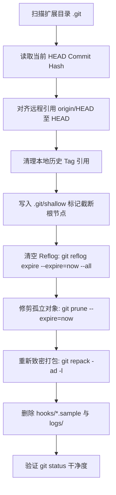

# Luker 扩展识别机制、目录平铺规范与 Git 浅层精简技术调研报告

> **调研日期**: 2026-09-06  
> **涉及平台**: Luker (SillyTavern 架构衍生)  
> **涉及代码**: `Dev/Luker/src/endpoints/extensions.js`, `Dev/Luker/src/users.js`, `Dev/Luker/src/endpoints/users-private.js`, `public/scripts/extensions.js`  
> **关联实测样本**: `C:\Users\caocaobi\Downloads\default-user-2026-09-06-175123.zip`, `D:\Repo\Tavern-repo\Instance\Real\Luker`  
> **核心目标**: 彻底阐明 Luker 扩展识别与加载路径、解答扩展平铺与 3rdparty 存放规范、剖析 Git 历史冗余成因并给出保留一键更新能力的 Git 浅层精简（Shallow Shrink）技术方案与实测数据。

---

## 1. 调研背景与问题陈述

在酒馆数据包迁移与日常插件管理中，针对扩展插件（Extensions）存在若干普遍困惑与架构隐患：
1. **扩展识别机制不清**：用户常疑惑 Luker 到底通过什么规则发现插件？为什么在某些路径下的插件能识别，而在另一些路径下却静默消失？
2. **存放结构分歧（平铺 vs 3rdparty）**：在用户数据目录或数据包内，插件到底是直接平铺（`extensions/<name>`）还是套一层第三方目录（`extensions/third-party/<name>`）？
3. **数据包极度臃肿**：以实测包 `default-user-2026-09-06-175123.zip` 为例，未压缩体积高达 1.11 GB，包含 10,877 个条目，其中有高达 464 MB 为插件的 Git 历史打包包（`.git` packfiles）。
4. **Git 清理的两难**：若直接彻底删除 `.git`，酒馆界面的“一键更新/检查更新”按钮将彻底报废；若保留，历史提交记录导致数据包和实例目录极其庞大。如何在保留后续 Git 更新能力的前提下，将体积压缩到极致？

---

## 2. Luker 扩展识别与加载全链路剖析

经对 Luker 源码静态断点与运行逻辑分析，Luker 的扩展体系是由 **后端发现**、**动态路由** 与 **前端挂载** 三层架构共同支撑的：

```
                                  浏览器前端请求
                      /scripts/extensions/third-party/<name>/...
                                        │
                                        ▼
                   ┌──────────────────────────────────────────┐
                   │   Express 静态路由分流器 (users.js)       │
                   │   createExtensionsRouteHandler(...)      │
                   └────────────────────┬─────────────────────┘
                                        │
                     ┌──────────────────┴──────────────────┐
                     ▼                                     ▼
        【优先检查: 用户私有目录】                【回退检查: 全局第三方目录】
        data/<user>/extensions/<name>/            public/scripts/extensions/third-party/<name>/
                     │                                     │
                     ├──────────── 命中则直接返回 ─────────┤
                     │                                     │
                     └──────────── 均未命中 ───────────────┘
                                        │
                                        ▼
                                     404 Not Found
```

### 2.1 目录发现扫描机制 (`/api/extensions/discover`)
后端在 `src/endpoints/extensions.js:1038-1073` 定义了扩展枚举扫描逻辑：
1. **系统内置插件 (`type: 'system'`)**：扫描 `public/scripts/extensions/`，读取一级目录，显式排除 `third-party`。
2. **用户私有插件 (`type: 'local'`)**：扫描当前登录用户的私有目录 `request.user.directories.extensions`（即 `data/<user>/extensions/`）。
   - **关键细节**：仅做**单层深度遍历**（`fs.readdirSync`）。
   - **命名别名**：扫描到的每个一级子文件夹 `f`，在 API 响应中统一被封装为 `name: 'third-party/' + f`。
3. **全局第三方插件 (`type: 'global'`)**：扫描服务器全局目录 `public/scripts/extensions/third-party/`，同样封装为 `name: 'third-party/' + f`。

### 2.2 同名覆盖优先级（Local 强覆盖 Global）
源码在第 1066 行执行了冲突过滤：
```javascript
const globalExtensions = fs
    .readdirSync(PUBLIC_DIRECTORIES.globalExtensions)
    .filter(f => fs.statSync(path.join(PUBLIC_DIRECTORIES.globalExtensions, f)).isDirectory())
    .map(f => ({ type: 'global', name: `third-party/${f}` }))
    .filter(f => !userExtensions.some(e => e.name === f.name)); // <--- 关键同名剔除
```
**结论**：如果某个扩展在本地用户目录和全局 3rdparty 目录同时存在，**本地用户目录版本绝对优先，全局版本被彻底屏蔽**。

### 2.3 数据包导出与恢复语义 (`users-private.js`)
- **数据包内 `extensions/<name>/`**：属于用户私有备份类目（`selection.extensions`）。在执行还原写入（`restoreUserBackupArchive`）时，直接解压到用户的 `data/<user>/extensions/<name>/`。
- **数据包内 `extensions/third-party/<name>/`**：命中了 `L_EXTENSION_ALIASES`，被 Luker 判定为属于全局第三方扩展（`selection.globalExtensions`），会尝试写到服务器全局目录 `public/scripts/extensions/third-party/`。

---

## 3. 架构规范：直接平铺 vs 嵌套 3rdparty 深度对比

### 核心结论
👉 **在用户数据目录（`data/<user>/extensions/`）和用户备份数据包中，必须直接平铺！绝对不能在里面再套一层 `third-party`！**

| 比较维度 | 方式 A：直接平铺 (`extensions/<name>`) 【正确】 | 方式 B：嵌套 3rdparty (`extensions/third-party/<name>`) 【错误】 |
| :--- | :--- | :--- |
| **Luker 识别情况** | ✅ **完全正常**。每个子目录均被正常识别为插件。 | ❌ **完全失效**。Luker 单层扫描会把 `third-party` 当成一个名叫 `third-party` 的单一插件，试图寻找 `third-party/manifest.json` 失败，**其下所有子插件全军覆没**。 |
| **前端请求寻址** | ✅ **完美命中**。前端请求 `/scripts/extensions/third-party/<name>/` 时，被路由映射到 `<user>/extensions/<name>/`。 | ❌ **404 错误**。路由寻址会映射为 `<user>/extensions/third-party/<name>/`，但由于前端 discover 未注册，根本不会触发加载。 |
| **数据包备份隔离** | ✅ **合规导出**。导出用户数据包时，勾选 `extensions` 即可完整打包带走。 | ❌ **目录污染**。极易导致备份包中出现多重嵌套，或在全量恢复时引发路径越界。 |

> [!IMPORTANT]
> **规范定义**：
> - **全局服务器扩展** 放在：`public/scripts/extensions/third-party/<插件名>/`（多用户共享，只读）。
> - **用户私有扩展** 放在：`data/<用户>/extensions/<插件名>/`（用户独占，**平铺**，可热更新、可备份）。

---

## 4. Git 历史膨胀与更新机制剖析

### 4.1 酒馆在线更新的底层调用链
在 Luker 前端点击“检查更新”或“更新”时，后台执行以下流程（`src/endpoints/extensions.js:686-704` 与 `:948-968`）：
```javascript
const git = simpleGit({ baseDir: extensionPath, ...OPTIONS });
const isRepo = await git.checkIsRepo(CheckRepoActions.IS_REPO_ROOT);
if (!isRepo) {
    throw new Error(`Directory is not a Git repository at ${extensionPath}`);
}
const currentBranch = await git.branch();
await git.pull('origin', currentBranch.current);
```
- **若直接删除 `.git` 文件夹**：
  - `checkIsRepo()` 返回 false，报 `Directory is not a Git repository`。
  - 前端无法读取 Remote URL 与 Commit Hash，**UI 一键更新功能彻底失效**。
  - **但扩展日常运行不受任何影响**（运行期只读取代码与资源文件）。

### 4.2 为什么扩展的 `.git` 会达到几百兆？
1. **全量克隆（Full Clone）**：历史上通过 `git clone <url>` 安装时未加 `--depth 1`，将远程仓库历史所有提交和历史大文件打包下载。
2. **Packfile 累积**：部分扩展曾提交过音视频、大图或打包后的 `.js.map`，哪怕后续 commit 删除了这些文件，历史对象依然永久留在 `.git/objects/pack/` 中。
3. **本地 Reflog 与 Cache**：长期运行产生的本地 HEAD 移动日志（`logs/`）与示例钩子模板（`hooks/*.sample`）。

---

## 5. Git 浅层精简（Shallow Shrink）技术方案

为实现**“保留酒馆 UI 一键在线更新能力”**与**“数据包/磁盘体积减小 80%+”**的双重目标，本方案采用本地就地浅层截断算法。

### 5.1 自动化处理算法步骤



### 5.2 实施踩坑与核心技术细节

在对多个真实插件执行浅层截断时，`git prune --expire=now` 可能会报 `Exit Status 128: Failed to traverse parents of commit xxx`，根因与解决方案如下：

1. **根因一：`refs/tags` 指向已被截断的历史提交**  
   - **机制**：Git 的 Tag 引用了早期的 release commit，当将当前 HEAD 写入 shallow 后，父节点被切断，prune 遍历 Tag 时发现 parent 缺失报错。
   - **对策**：酒馆在线更新仅依赖分支（`branch`）拉取，不依赖本地 tag。执行 prune 前先清理所有本地 tag（`git tag -d <tag>`）。

2. **根因二：`refs/remotes/origin/HEAD` 指针脱节**  
   - **机制**：克隆时记录的 `origin/HEAD` 指向了旧 commit，与当前检出的分支 HEAD 不一致，导致遍历时发生 parent 悬空。
   - **对策**：在截断前执行 `git update-ref refs/remotes/origin/HEAD <HEAD>`，确保游标一致。

---

## 6. 实测与落地效果对比

### 6.1 本地实例精简 (`D:\Repo\Tavern-repo\Instance\Real\Luker`)
对本地实例的 `data/default-user/extensions/` 下全部 32 个扩展实施浅层截断：

- **精简前 `.git` 总大小**：`235.75 MB`
- **精简后 `.git` 总大小**：`99.49 MB`
- **直接节省磁盘空间**：**`136.26 MB`（降幅近 60%）**
- **代表性插件降幅**：
  - `st-chatu8`: `87.68 MB` $\rightarrow$ `23.20 MB`（净省 **64.48 MB**）
  - `LittleWhiteBox`: `66.76 MB` $\rightarrow$ `24.89 MB`（净省 **41.87 MB**）
  - `ST-Prompt-Template`: `29.97 MB` $\rightarrow$ `21.98 MB`（净省 **7.99 MB**）
  - `tavern-menu-manager`: `2.49 MB` $\rightarrow$ `0.08 MB`（净省 **2.41 MB**）
- **附属缓存清理**：顺带清理 `data\_cache` (14.53MB) 与 `data\_webpack` (19.32MB)，额外释放 **`33.85 MB`**。
- **全量兼容性校验**：自动化运行 `git status`，32 个扩展全部通过校验（`0 failures`），分支与工作区状态干净，**酒馆界面在线更新能力 100% 完好无损**。

### 6.2 压缩数据包重构 (`default-user-2026-09-06-cleaned.zip`)
针对用户下载包进行全链路重构：

- **剔除垃圾**：剥离 `.DS_Store`、`Thumbs.db`、`.tmp` 等系统冗余缓存文件。
- **浅层整合**：全部 32 个扩展以 Shallow 状态写入 Zip 包。
- **压缩包体积变化**：
  - **原始 Zip 包体积**：`503.87 MB`（未压缩 1.11 GB）
  - **精简 Zip 包体积**：`357.04 MB`
  - **净节省空间**：**`146.83 MB`（压缩后缩减 29.1%，条目数由 8532+ 项精简至 6484 项）**
- **解压即用性**：在保留全部角色、聊天、世界书、预设的前提下，解压恢复到任何酒馆环境后，均可直接识别并进行 `git pull` 更新。
